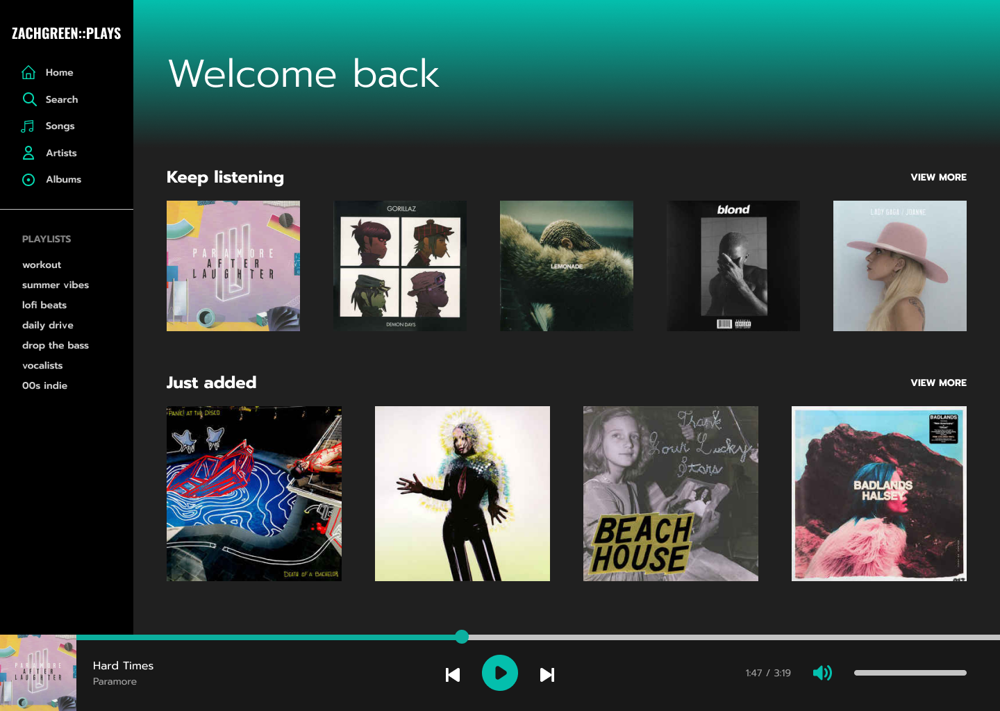
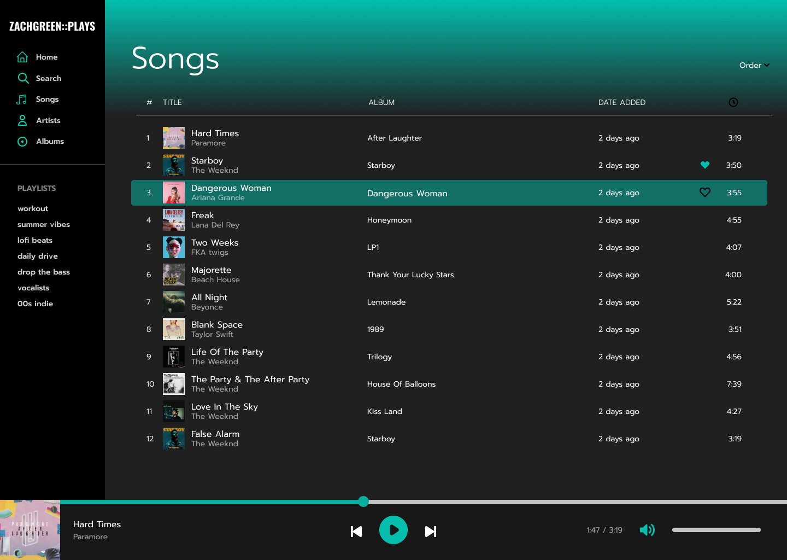

# MusicFrontend

Stuff I used in/for this project
- [Angular](https://angular.io/)
- [TailwindCSS](https://tailwindcss.com/)
- [Luxon](https://moment.github.io/luxon/)
- [Figma](https://www.figma.com/)

[Come take it for a spin](music.zachgreen.codes)

This project was generated with [Angular CLI](https://github.com/angular/angular-cli) version 12.0.2.
